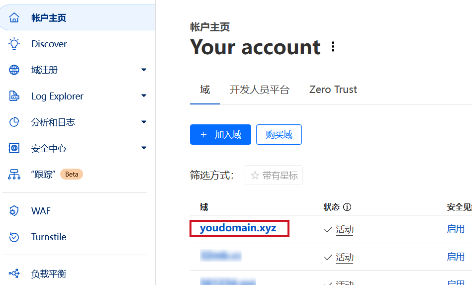
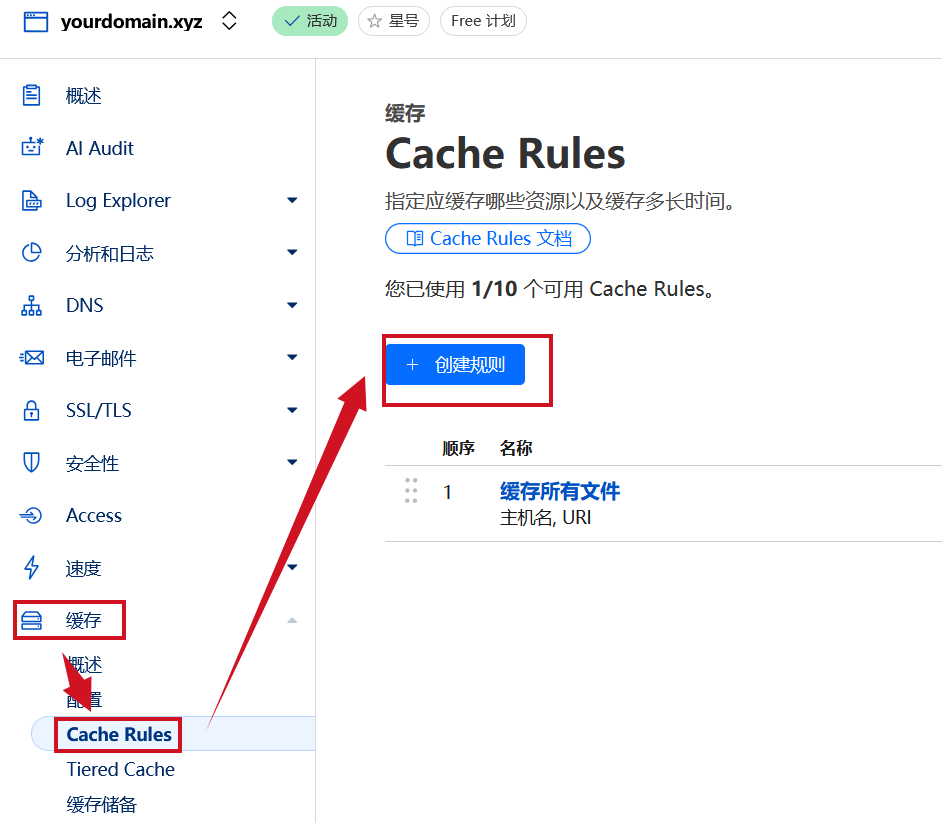

# 部署指南

本指南提供了将 TG-FileBed 应用部署到 Cloudflare Workers 的详细步骤。

## 先决条件

-   您拥有一个 Cloudflare 账户。
-   需要一个可以使用 Cloudflare 的域名（无论几级，能绑定到 Cloudflare 就行）
-   您已安装 `npm` 和 `npx`。
-   您已通过 Wrangler (`npx wrangler login`) 登录到您的 Cloudflare 账户。

## 步骤一：创建 D1 数据库

您需要创建两个数据库：一个用于生产环境，另一个用于本地开发。

1.  **创建生产数据库：**
    ```sh
    npx wrangler d1 create tg-filebed-db
    ```

2.  **创建开发数据库：**
    ```sh
    npx wrangler d1 create tg-filebed-db-dev
    ```

## 步骤二：初始化数据库结构

创建数据库后，您需要应用迁移文件来初始化数据库表结构。

1.  **初始化生产数据库：**
    ```sh
    npx wrangler d1 execute tg-filebed-db --file=./migrations/0000_create_images_table.sql
    ```

2.  **初始化开发数据库（用于本地测试）：**
    ```sh
    npx wrangler d1 execute tg-filebed-db-dev --local --file=./migrations/0000_create_images_table.sql
    ```

## 步骤三：配置 `wrangler.toml`

您必须将每个数据库唯一的 `database_id` 添加到您的 `wrangler.toml` 文件中。

1.  **获取生产数据库 ID：**
    ```sh
    npx wrangler d1 info tg-filebed-db
    ```
    从输出中复制 "UUID" 的值。

2.  **获取开发数据库 ID：**
    ```sh
    npx wrangler d1 info tg-filebed-db-dev
    ```
    从输出中复制 "UUID" 的值。

3.  **更新 `wrangler.toml`：**
    打开 `wrangler.toml` 文件，为 `production` 和 `dev` 环境填入相应的 `database_id`，其他配置（USERNAME, PASSWORD, BOT_TOKEN, CHAT_ID, MAX_FILE_SIZE, SITE_TITLE, WAIT_TIME）根据您的需求进行修改。
    修改 `route` 配置以使用您的域名。

    ```toml
    # wrangler.toml
    
    # ... 其他配置 ...
    
    route = { pattern = "your_domain.tld/*", zone_name = "your_domain.tld" }
    
    [env.production]
    [[env.production.d1_databases]]
    binding = "DB"
    database_name = "tg-filebed-db"
    # 部署时必须指定 database_id。
    # 运行 `npx wrangler d1 info tg-filebed-db` 来获取 ID。
    database_id = "您的生产数据库ID" # <-- 在此处粘贴 ID
    
    # ... 其他配置 ...
    
    [vars]
    # These variables are accessible in all environments unless overridden.
    # For local development, define these in the `.dev.vars` file.
    # For production, set them as secrets.
    USERNAME = ""
    PASSWORD = ""
    BOT_TOKEN = ""
    CHAT_ID = ""
    MAX_FILE_SIZE = "20971520" # 20MB
    SITE_TITLE="虚假的图床"
    WAIT_TIME = "20"


    # ... 其他配置 ...
    
    [env.dev]
    [[env.dev.d1_databases]]
    binding = "DB"
    database_name = "tg-filebed-db-dev"
    database_id = "您的开发数据库ID" # <-- 在此处粘贴 ID
    
    # ... 其他配置 ...
    ```

## 步骤四：配置机密信息

为您的应用程序设置必要的机密信息。这些是敏感数据，不应提交到您的代码仓库中。

```sh
npx wrangler secret put BOT_TOKEN
npx wrangler secret put CHAT_ID
npx wrangler secret put USERNAME
npx wrangler secret put PASSWORD
```
Wrangler 将提示您为每个机密信息输入对应的值。

## 步骤五：部署应用

完成所有配置后，您就可以部署您的应用了。

```sh
npx wrangler deploy
```

## 步骤六：配置图片缓存
为了提高图片访问速度，您需要配置 Cloudflare 的缓存策略。

1. **打开 Cloudflare Workers 控制台：**
   登录到您的 Cloudflare 账户，然后导航到账户首页。

2. **选择您的域名：**
   在域名列表中选择您的域名。
   

3. **配置缓存策略：**
   点击左侧导航栏中的 "缓存" 选项，然后选择 "Cache Rules"。
   

4. **添加缓存规则：**
   然后点击 "+ 创建规则"，添加一个缓存半年的规则，按照图片选择，然后把 "yourdomain.xyz" 替换为您的域名。点击保存后缓存很快就会生效。
   

