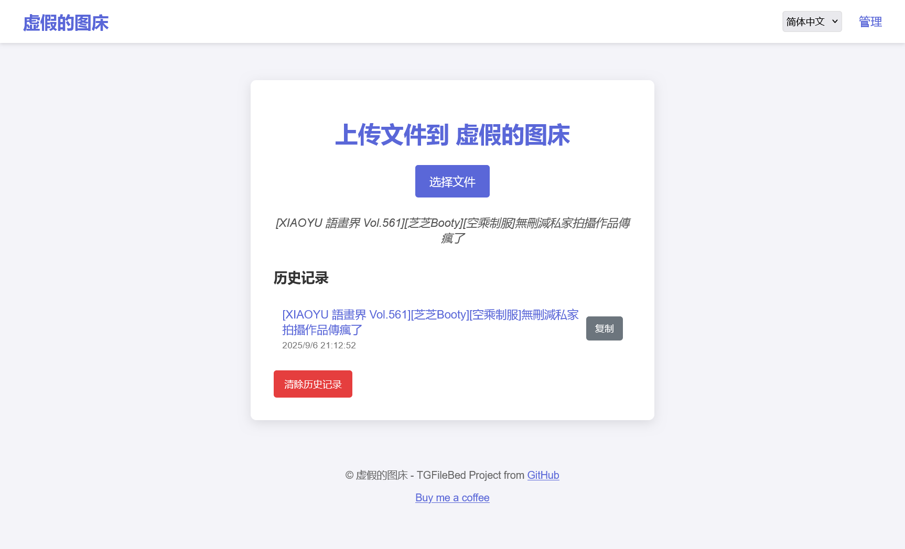

# 基于 Cloudflare Workers 的 Telegram 图床

本项目提供了一个自托管的图床服务，使用 Telegram 作为存储，运行在 Cloudflare Workers 上，并以 D1 作为数据库。



## 功能特性

- 通过网页界面和 API 上传文件
- 支持分页的图片列表
- 删除图片（单个或全部）
- 所有管理端点均受基本身份认证（Basic Authentication）保护
- 使用 Wrangler 轻松部署

## 先决条件

- 一个 Cloudflare 账户
- 已安装 Node.js 和 npm
- 一个 Telegram 机器人及其令牌（Token）
- 一个 Telegram 聊天 ID（机器人需要有权限在该聊天中发送消息）

## 安装与部署

1.  **克隆代码仓库：**
    ```bash
    git clone https://github.com/benzBrake/TGFileBed tg-filebed
    cd tg-filebed
    ```

2.  **安装依赖：**
    ```bash
    npm install
    ```

3.  **登录 Wrangler：**
    ```bash
    npx wrangler login
    ```

有关创建数据库、运行迁移和部署应用程序的详细说明，请参阅[部署指南](DEPLOYMENT_zh-CN.md)。

部署完成后，您可以通过 Wrangler 提供的 URL 访问您的图床服务。

## 网页界面
-   `GET /`: 文件上传页面。
-   `GET /manage.html`: 带有分页功能的图片管理页面。

## API 端点
-   `POST /upload`: 文件上传 API 端点。
-   `GET /list`: 列出所有上传的图片（JSON 响应）。
-   `GET /delete/:hashid`: 删除特定图片。
-   `GET /delete/all`: 删除所有图片。
-   `GET /file/:filename`: 提供上传的图片。
所有管理端点（`/`, `/upload`, `/list`, `/manage`, `/delete/*`）都受基本身份认证保护。

## 支持

如果您觉得这个项目有帮助，请考虑请我喝杯咖啡：

[](https://www.buymeacoffee.com/buyryanacoffie)